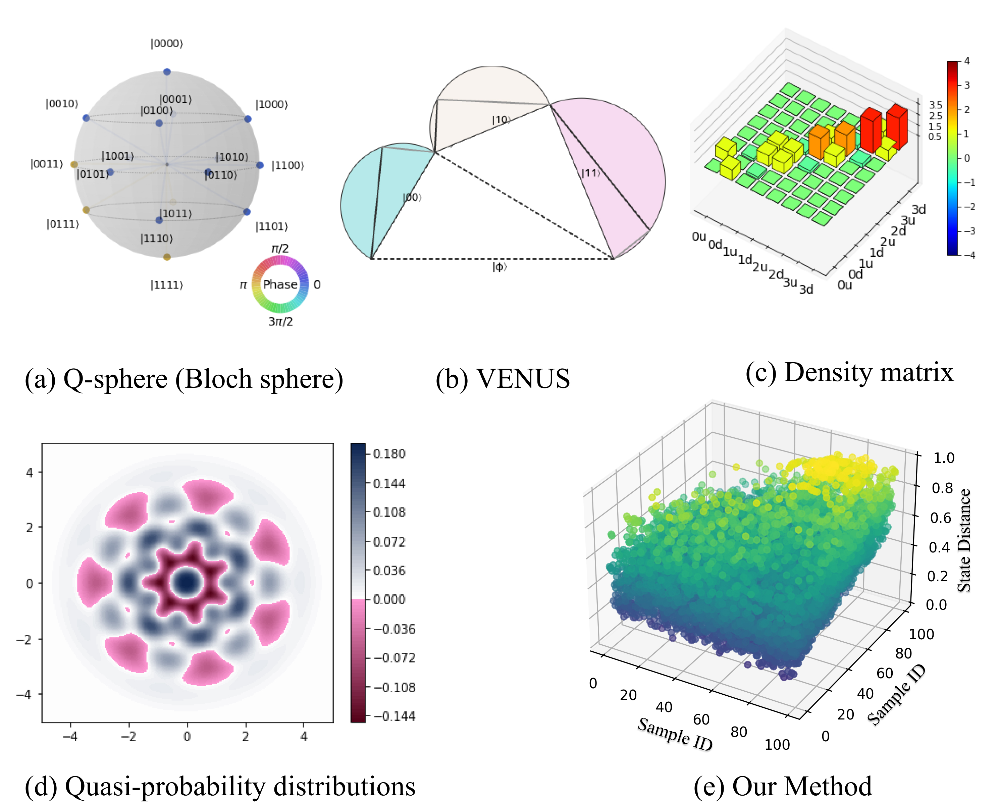
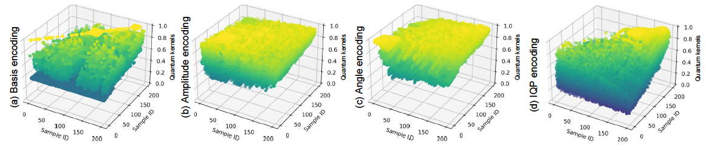
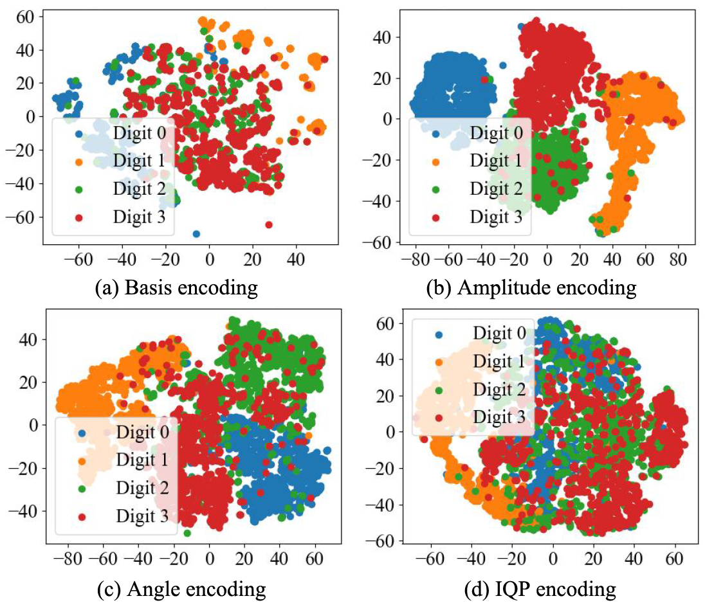

### HermesQuantVis: Distance-Based Visualization of Quantum States Across Diverse Data Samples


<center>Figure 1: Different visualization methods for quantum states.</center>

## Introduction

HermesQuantVis is the first visualization framework that allows for the simultaneous visualization of multiple quantum states, visualizing comparisons of quantum state diversity by calculating quantum state distances via the quantum kernel method, rather than focusing on single quantum states. HermesQuantV is compared with widely used state visualization techniques such as Q-sphere[<sup>1</sup>](#refer-anchor-1), VENUS[<sup>2</sup>](#refer-anchor-2), and proposed probability distribution[<sup>4</sup>](#refer-anchor-4). An example study of a QNN classification task shows that the design has clear visualization properties and that the state distance metric is consistent with the performance of QNN classifiers.


<center>Figure 2: Visualization for quantum kernels of four quantum encoding methods on MNIST-4.</center>

The high-dimensional feature space induced by the quantum kernel presents a challenge for direct visualization. To gain insights into the structure of multiple quantum states, we can employ t-distributed Stochastic Neighbor Embedding (t-SNE) [17] or Principal Component Analysis (PCA) [10] for dimensionality reduction. For example, t-SNE combined with the quantum kernel as Follows:

<center>Figure 3: t-SNE reduction visualization results on MNIST-4 classification task.</center>


## Requirements

```bash
pip install scipy
pip install numpy
pip install pandas
pip install matplotlib
pip install sklearn
pip install torch
pip install qiskit
pip install qutip
```

## Quantum state data

The ./encoded_data/ folder includes encoded quantum state data instances (involving 4 types of encoding methods, i.e., State, Amplitude, Angle, IQP) for the MNIST four-classification task (0, 1, 2, 3). 

### References
<div id="refer-anchor-1"></div>

- [Quantum computing and visualization: A disruptive technological change ahead](https://arxiv.org/abs/2310.04937), Bethel, E. W., Amankwah, M. G., Balewski, J., Van Beeumen, R., Camps, D., Huang, D., & Perciano, T. (2023). *IEEE Computer Graphics and Applications, 43*(6), 101–111.

<div id="refer-anchor-2"></div>

- [VENUS: A geometrical representation for quantum state visualization. *Computer Graphics Forum](https://arxiv.org/abs/2303.08366), Ruan, S., Yuan, R., Guan, Q., Lin, Y., Mao, Y., Jiang, W., ... Wang, Y. (2023). 42*(3), 247–258.

<div id="refer-anchor-3"></div>

- [Visualization of correlations in hybrid discrete—continuous variable quantum systems](https://iopscience.iop.org/article/10.1088/2399-6528/ab6fb6), Rundle, R. P., Davies, B. I., Dwyer, V. M., Tilma, T., & Everitt, M. J. (2020). *Journal of Physics Communications, 4*(2), 025002.

<div id="refer-anchor-4"></div>

- [ Quasi-probability representations of quantum theory with applications to quantum information science](https://arxiv.org/abs/1010.2701), Ferrie, C. (2011). *Reports on Progress in Physics, 74*(11), 116001.

<div id="refer-anchor-5"></div>

- [Quantum process tomography of the quantum Fourier transform](https://arxiv.org/abs/quant-ph/0406239), Weinstein, Y. S., Havel, T. F., Emerson, J., Boulant, N., Saraceno, M., Lloyd, S., & Cory, D. G. (2004).  *The Journal of Chemical Physics, 121*(13), 6117–6133.

<div id="refer-anchor-6"></div>

- [Visualizing data using t-SNE](https://www.jmlr.org/papers/volume9/vandermaaten08a/vandermaaten08a.pdf), Van der Maaten, Laurens and Hinton, Geoffrey. (2008) Journal of machine learning research, 9*(11).

<div id="refer-anchor-7"></div>

- [Using t-distributed Stochastic Neighbor Embedding (t-SNE) for cluster analysis and spatial zone delineation of groundwater geochemistry data](https://www.sciencedirect.com/science/article/pii/S0022169421001931), Liu, Honghua, et al. Journal of Hydrology 597 (2021): 126146.

